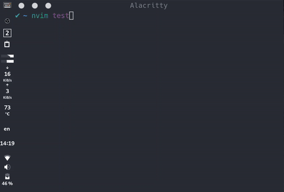

# vim-ibus-sw



note: released version without debug messages.

---

This plugin is for Vim users that use Ibus to be eased to handle multiple input methods when changing between normal and insert mode(eg. English and Chinese).

The method implemented is very simple.

No matter in normal and insert mode, the input status must be cached, respectively, and restore the previous status of another mode.

Such as updating the cache with the current input status before leaving insert mode and then switching to the input status cached previous at normal mode while entering normal mode.

## Features:

* Auto cache input status and restore.
* Switch input status asynchronously.
* Lazy Load to reduce startup time.

> The lasted version of neovim and vim both support the async job, 'vim-ibus-sw' is compatible with them. If the older vim doesn't support the async job, it will run system call synchronously ten times slower than the async job. 

---

## Requirement:
* [ibus](https://github.com/ibus/ibus)
* [vim](https://github.com/vim/vim) or [neovim](https://github.com/neovim/neovim)

## Installation

Use your plugin manager like [Vim-plug](https://github.com/junegunn/vim-plug)

Put below code in your `~/.vimrc` or `~/.config/nvim/init.vim`.

```vim
Plug 'kevinhwang91/vim-ibus-sw'
```

Then restart vim and run `:PluginInstall` to install.

---

## Principle

**If your Desktop Environment is not Gnome, the plugin switch input method by the 'ibus engine' command. When switching input method, tray icon of ibus change nothing.**

Using 'ibus engine' brings a bug when using 'Allow different sources for each window' option in input settings in Gnome Desktop Environment, because every progress has a session to save the input status, and restore the data from the session when you refocus on the application.

'ibus engine' can't change this session. Therefore, when you focus lost (neo)vim window and return back later, Gnome Desktop will restore the session for raw input status.

So I use 'FocusGained'(vim may not work) action in (neo)vim to restore the input status by 'ibus engine', It solves the single (neo)vim window problem. If you running (neo)vim inside tmux, and switching to other panes of tmux and then focus lost tmux, it will lead to the lastest pane become input status at insert mode because of the unchanged session of tmux.

Gnome Desktop Environment whose default input method is ibus. Switching input status by 'dbus'(dbus is faster than gdbus for switching input status), which can change the session of applications, it seems no problem anymore.

So using 'dbus' is the first choice rather than 'ibus engine'.

---

## Configuration

If you want to disable the plugin, set `let g:ibus_sw_enable = 0`.

When you use [vim-multiple-cursors](https://github.com/terryma/vim-multiple-cursors), please appending below vim-multiple-cursors hook function in vim or neovim config file.

Without the below hook function, the CPU load is high and (neo)vim became very very slow when entering multiple edit mode using vim-multiple-cursors.

```vim
function! Multiple_cursors_before()
    call is#input_trigger_disable()
endfunction
function! Multiple_cursors_after()
    call is#input_trigger_enable()
endfunction
```
I pressume that the principle of vim-multiple-cursors will often switch insert and normal mode causing this problem, so its author leave this hook and other plugins can use this hook to solve performance.

### Suggestion

Anyway, I suggest you use [vim-visual-multi](https://github.com/mg979/vim-visual-multi) instead of [vim-multiple-cursors](https://github.com/terryma/vim-multiple-cursors), faster and have other awesome features.

Using vim-visual-multi, It doesn't need hook function like vim-multiple-cursors anymore!!!
